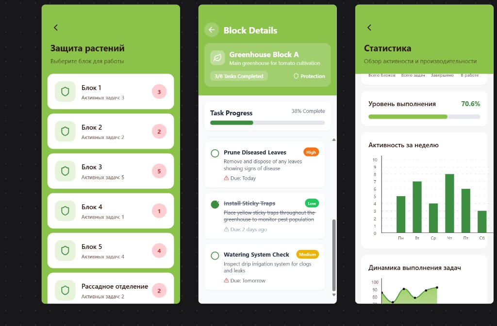

# Standard Form Layout Template

Use this template for all data entry screens.



## Visual Style

### Theme Colors
- **Primary Green**: `#7CB342` (Header background, active elements)
- **Background**: `#F5F5F5` (Light gray screen background)
- **Card Background**: `#FFFFFF` (White)
- **Text Primary**: `#333333`
- **Text Secondary**: `#666666`
- **Status Red**: `#E57373`
- **Status Green**: `#81C784`

### Container
- Background: `#F5F5F5`
- Padding: 16

### Header
- Background: `#7CB342`
- Padding: 20
- Border Bottom Left Radius: 20
- Border Bottom Right Radius: 20
- **Title**:
  - Font Size: 22
  - Weight: Bold
  - Color: White
  - Margin Bottom: 5
- **Subtitle**:
  - Font Size: 14
  - Color: White (Opacity 0.8)

### Cards (Data Entry / List Items)
- Background: White
- Border Radius: 12
- Padding: 16
- Margin Bottom: 12
- Shadow: `0px 2px 4px rgba(0,0,0,0.1)` (Elevation 2)

### Inputs
- Background: `#F9F9F9`
- Border Width: 1
- Border Color: `#E0E0E0`
- Border Radius: 8
- Padding: 12
- Margin Top: 8
- Margin Bottom: 16
- Font Size: 16

### Buttons
- **Primary**:
  - Background: `#7CB342`
  - Border Radius: 25 (Rounded Pill)
  - Padding Vertical: 12
  - Padding Horizontal: 24
  - Text Color: White
  - Font Weight: Bold
- **Secondary**:
  - Background: Transparent
  - Border Width: 1
  - Border Color: `#7CB342`
  - Text Color: `#7CB342`

## Example Structure

```tsx
<View style={styles.screen}>
  {/* Header */}
  <View style={styles.header}>
    <Text style={styles.headerTitle}>{title}</Text>
    <Text style={styles.headerSubtitle}>Subtitle here</Text>
  </View>

  {/* Content */}
  <ScrollView contentContainerStyle={styles.content}>
    <View style={styles.card}>
      <Text style={styles.label}>Label</Text>
      <TextInput style={styles.input} />
      
      <TouchableOpacity style={styles.primaryButton}>
        <Text style={styles.buttonText}>Action</Text>
      </TouchableOpacity>
    </View>
  </ScrollView>
</View>
```
